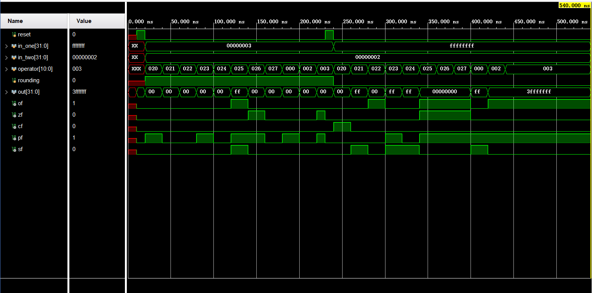
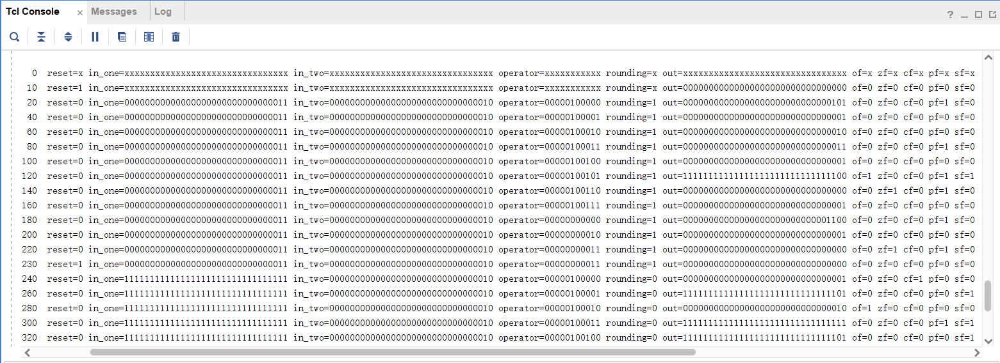
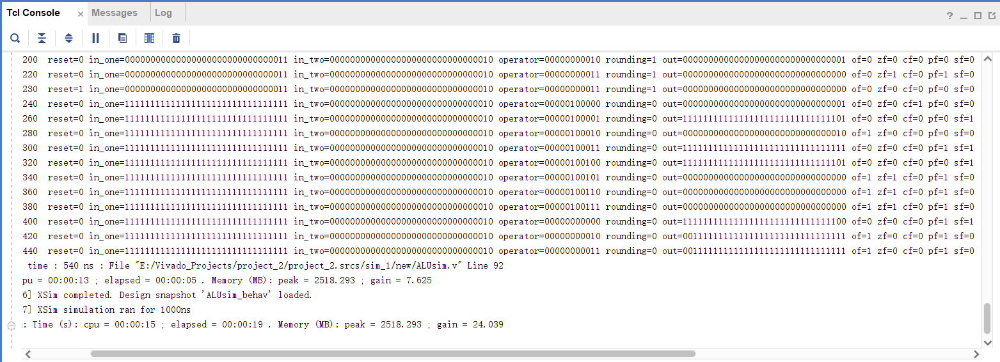
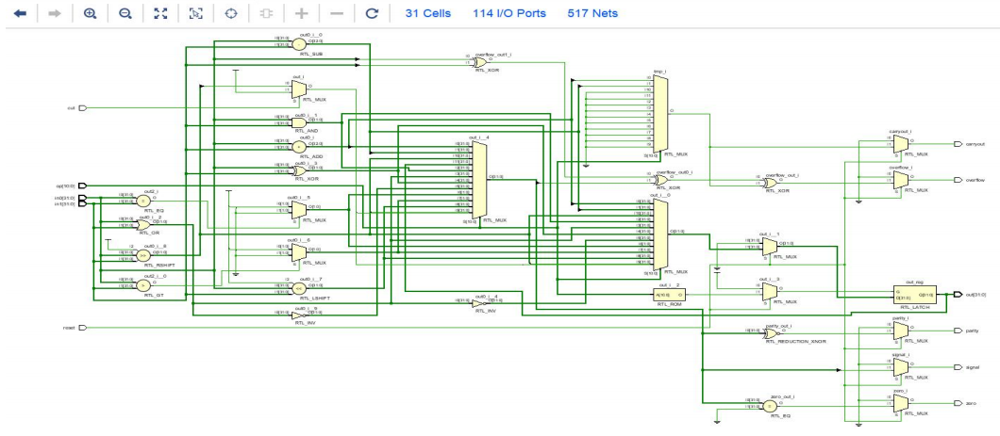

# 32位ALU 实验报告

- 姓名：周豪捷
- 学号：1120211099
- 班级：07032101

>## 实验环境

- **Vivado 2019.2**
- **语言：Verilog HDL**

>## 实验要求

1. 支持至少8种运算

2. 输出5个标志符号：SF（符号位），CF（进位标志），ZF（零标志），OF（溢出标志）和PF（奇偶标志）

3. 支持左右移位操作

4. 可支持至少两种舍入操作

>## 实验过程

### 支持的八种运算

<center>

|运算符 | 运算说明 | 编码|
|:---:| :---: | :---:|
|add | 有符号数加法 | 00000100000|
|sub | 有符号数减法 | 00000100001|
|and | 按位与 | 00000100010|
|or | 按位或 | 00000100011|
|xor | 按位异或 | 00000100100|
|nor | 按位或非 | 00000100101|
|equ | 有符号数相等比较 | 00000100110|
|cmp | 有符号数大小比较 | 00000100111|

</center>

### 支持的左右移位

<center>

|运算符 | 运算说明 | 编码|
|:---: | :---: | :---:|
|sllv | 算数左移 | 00000000000|
|srlv | 算数右移 | 00000000010|
|srav | 逻辑右移 | 00000000011|

</center>

### 支持的两种舍入

<center>

| rounding | 含义|
| :---: | :---:|
|0 | 保持原值|
|1 | 置1|

</center>

### 变量说明

<center>

|变量名称 | 变量含义 | 变量长度(bit)|
|:---: | :---: | :---:|
|reset | 初始化置零位 | 1|
|rounding | 舍入方式位 | 1|
|in_one | 第一个操作数 | 32|
|in_two | 第二个操作数 | 32|
|op | 操作符 | 11|
|out | 运算结果 | 32|
|sf | 符号标志位 | 1|
|cf | 进位/借位标志位 | 1|
|zf | 零标志位 | 1|
|of | 溢出标志位 | 1|
|pf | 奇偶标志位 | 1|

</center>

### 详细代码

#### ALU.v

```verilog
`timescale 1ns / 1ps
//////////////////////////////////////////////////////////////////////////////////
// Company: BIT
// Engineer: 周豪捷
// 
// Create Date: 2024/06/05 15:32:37
// Design Name: 
// Module Name: ALU
// Project Name: 32bit ALU
// Target Devices: 
// Tool Versions: Vivado 2019.2
// Description: 
// 
// Dependencies: 
// 
// Revision:
// Revision 0.01 - File Created
// Additional Comments:
// 
//////////////////////////////////////////////////////////////////////////////////


module ALU(
    reset, in_one, in_two, operator, rounding, out, of, zf, cf, pf, sf
    );
    input reset;                        //  初始化置零
    input[31:0] in_one, in_two;         //  操作数
    input[10:0] operator;               //  操作运算符
    input rounding;                     //  舍入控制
    output[31:0] out;                   //  运算结果
    output of, zf, cf, pf, sf;          //  溢出标志、零标志、进位/借位标志、奇偶标志、符号位
    reg[31:0] out;                       
    reg of,zf,cf,pf,sf;
    
always@(*)
                     
begin
     if(reset)
        //  reset = 1，进行初始化
        begin
            out=0;
            of=0;
            zf=0;
            cf=0;
            pf=0;
            sf=0;
        end
     else
        //  reset = 0，封装ALU任务
         alutask( in_one, in_two, operator, rounding, out, of, zf, cf, pf, sf);      
end

//  ALU任务定义
task alutask;                  
    input[31:0] in_one, in_two;       
    input[10:0] operator;   
    input rounding;         
    output[31:0] out;         
    output of, zf, cf, pf, sf;
    reg[31:0] out;
    reg temp, pmt, of, zf, cf, pf, sf;
   
    begin
        //  进行运算前将所有标志位清0
        of=0;            
        cf=0;
        zf=0;
        pf=0;
        sf=0;
        
        case( operator )
            //  有符号数的加法运算
            11'b00000100000:
                            begin
                                {temp,out} = in_one + in_two;
                            end
            //  有符号数的减法运算
            11'b00000100001:
                            begin
                                {temp,out } = in_one - in_two;
                            end
            //  按位或非
            11'b00000100101: 
                out = ~(in_one | in_two);
            //  按位与
            11'b00000100010: 
                out = in_one & in_two;
            //  按位或
            11'b00000100011: 
                out = in_one | in_two;
            //  按位异或
            11'b00000100100: 
                out = in_one ^ in_two;
            //  有符号数的相等比较运算
            11'b00000100110: 
                out = ( $signed(in_one) == $signed(in_two) )? 1:0;
            //  有符号数的大小比较运算
            11'b00000100111: 
                out = ( $signed(in_one) > $signed(in_two) )? 1:0;
            //  算术左移
            11'b00000000000: 
                out = in_one << in_two;
            //  算术右移
            11'b00000000010:                             
                            begin
                            out = in_one >> in_two;
                            //  舍入判断
                            case( rounding )
                                //  保持原值
                                1'b0:
                                    out[0]=out[0];
                                //  置1           
                                1'b1:
                                    out[0]=1;
                            endcase
                            end
            //  逻辑右移
            11'b00000000011: 
                out = in_one >>> in_two;
    
        endcase
        
        if(out == 0)
            zf = 1;
        else
            zf = 0;
        cf = temp;
        of = in_one[31] ^ in_two[31] ^ out[31] ^ temp;
        sf = out[31];
        pf = ~^out;
        
    end
endtask
endmodule
```

#### ALUsim.v

```verilog
`timescale 1ns / 1ps
//////////////////////////////////////////////////////////////////////////////////
// Company: BIT
// Engineer: 周豪捷
// 
// Create Date: 2024/06/05 15:34:58
// Design Name: 
// Module Name: ALUsim
// Project Name: 
// Target Devices: 
// Tool Versions: 
// Description: 
// 
// Dependencies: 
// 
// Revision:
// Revision 0.01 - File Created
// Additional Comments:
// 
//////////////////////////////////////////////////////////////////////////////////


module ALUsim;

// 声明输入和输出寄存器和线
reg reset;                 // 复位信号
reg [31:0] in_one, in_two; // 32位输入操作数
reg [10:0] operator;       // 11位操作符信号
reg rounding;              // 四舍五入标志
wire [31:0] out;           // 32位输出结果
wire of, zf, cf, pf, sf;   // 标志: 溢出、零、进位、奇偶校验、符号

// 实例化ALU模块
ALU unit(            
    .reset(reset),
    .in_one(in_one),
    .in_two(in_two),
    .operator(operator),
    .rounding(rounding),
    .out(out),
    .of(of),
    .zf(zf),
    .cf(cf),
    .pf(pf),
    .sf(sf)
);

initial begin
    // 初始复位序列
    #10 
        reset = 1;
    #10 
        reset = 0;
        in_one = 32'd3;   // 设置第一个输入操作数为3
        in_two = 32'd2;   // 设置第二个输入操作数为2
        rounding = 1'b1;  // 启用四舍五入

        // 测试一系列操作符值
        for(operator = 11'b00000100000; operator < 11'b00000100111; operator = operator + 1)
            #20; // 每个操作符等待20个时间单位

    #20 
        operator = 11'b00000000000; // 将操作符设置为特定值
    #20 
        operator = 11'b00000000010; // 将操作符设置为另一个特定值
    #20 
        operator = 11'b00000000011; // 将操作符设置为再一个特定值

    // 再次复位
    #10 
        reset = 1;
    #10 
        reset = 0;
        in_one = -32'd1;  // 设置第一个输入操作数为-1
        in_two = 32'd2;   // 设置第二个输入操作数为2
        rounding = 1'b0;  // 禁用四舍五入
        
        // 再次测试一系列操作符值
        for(operator = 11'b00000100000 ; operator < 11'b00000100111; operator = operator + 1)
            #20; // 每个操作符等待20个时间单位

    #20 
        operator = 11'b00000000000; // 将操作符设置为特定值
    #20 
        operator = 11'b00000000010; // 将操作符设置为另一个特定值
    #20 
        operator = 11'b00000000011; // 将操作符设置为再一个特定值
    
    // 在100个时间单位后结束仿真
    #100 
        $finish;
end

initial
    // 监视变化并在每个时间步显示值
    $monitor($time,,,
        "reset=%b in_one=%b in_two=%b operator=%b rounding=%b out=%b of=%b zf=%b cf=%b pf=%b sf=%b",
        reset, in_one, in_two, operator, rounding, out, of, zf, cf, pf, sf);

endmodule
```

### 仿真波形图



### 仿真日志





### RTL 原理图



>## 实验总结

在本次实验过程中，我使用了 Verilog HDL 实现了 32 位 ALU，通过认真学习课程资料和阅读相关文档，我更加深入地理解了ALU的工作原理和不同操作符的实现方式，同时也熟悉了Vivado的使用和设计、仿真代码的编写，让我收获了很多。
